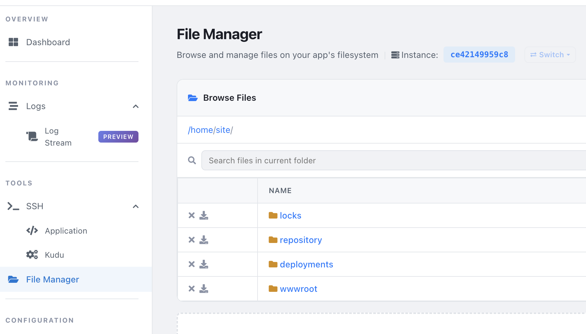

# Azure App services

## Plan
App Service plans determine the location, scale, and features available for the web app.

## Configuration 

1. See [environment variables](https://learn.microsoft.com/en-us/azure/app-service/reference-app-settings).
2. **health** endpoint are configured in App Service Configuration -> Health Check. It can be /health or /healthz or custom.
3. WEBSITES_ENABLE_APP_SERVICE_STORAGE = true, set to persisted data. Default to false, and useful for persisting data in the container (not recommended, use Azure Storage instead).
4. **always_on**, means does not scale to 0. Take note: App services scales to 0 after 15mins of unused time if always_on is not set.
5. WEBSITES_PORT = 80, App services use dynamic port, make sure you set this value.
6. Start up with 
```bash
az webapp config set \
    --resource-group myResourceGroup \
    --name myDocumentProcessor \
    --startup-file "/bin/bash -c 'python migrate.py && gunicorn app:application'"
```
7. Can use file `--settings @settings.json` instead of `--startup-file` for multiple configurations.
8. Using keyvault.
    - Keyvault reference identity must be set to System-assigned managed identity for App service's Service Principal.
    - Enable with `az webapp update --resource-group <group-name> --name <app-name> --set keyVaultReferenceIdentity=$(az identity show --resource-group <group-name> --name <identity-name> --query id -o tsv)`
    - Set keyvault with `--settings API_KEY="@Microsoft.KeyVault(SecretUri=https://myvault.vault.azure.net/secrets/api-key)"`.
    - Auto update secret change check interval is 24 hours due to cache. [link](https://learn.microsoft.com/en-us/azure/app-service/app-service-key-vault-references)

## Deployment Slots

1. Enabled with Basic, Standard, Premium, and Isolated pricing tiers. Not available for Free or Shared tiers. 5 slot or 20 slots.
2. Deployment, works like KEDA after new code is deployed to the slot, the app will be restarted, then traffic will be shifted to the new slot.
    - Blue/Green
    - Canary Releases - lil' by lil'
3. Enable promote and also change for "API_ENDPOINT".
```bash
az webapp config appsettings set \
    --resource-group myResourceGroup \
    --name myDocumentProcessor \
    --slot staging \
    --slot-settings \
        ENVIRONMENT=staging \
        API_ENDPOINT=https://api-staging.example.com
```
4. Sticky connection is important! Sticky Connection - for stateful apps where prod/staging has own configuration. When swapped only the app configuration will be swapped, not the sticky connection. It means prod/staging still use own configuration after swap. If not check, swap will swap database and configurationas well. Check it in Configuration -> General Settings.
```
**Scenario A**: The Checkbox is UNCHECKED (Not Sticky)

By default, settings are not sticky. This means the configuration is glued to your Code.

Before Swap: Your Staging slot is running Code_v2 and has the Test_Database configuration. Your Production slot is running Code_v1 and has the Prod_Database configuration.

The Swap: You click swap.

After Swap: Code_v2 moves to Production, but it brings the Test_Database configuration with it! Your production users are now accidentally reading and writing to your test database. Meanwhile, Code_v1 goes to Staging and takes the Prod_Database setting with it. (This is usually a disaster for backend systems).

***Scenario B***: The Checkbox is CHECKED ("Deployment slot setting" / Sticky)

When you check this box, you un-glue the configuration from the code and nail it to the floor of the Slot itself.

Before Swap: Staging has Code_v2 (nailed down: Test_Database). Prod has Code_v1 (nailed down: Prod_Database).

The Swap: You click swap.

After Swap: The code swaps, but the settings stay exactly where they were! Production now gets the shiny new Code_v2, but because the Prod_Database setting is nailed to the Production slot floor, Code_v2 automatically connects to the real production data. Staging gets Code_v1 and connects to the test data.
```

## Kudu
Kudu is a service for deploying and managing web applications.



## Troubleshooting
1. Logs

| Category | Description
| --- | --- |
| AppServiceConsoleLogs | Container stdout and stderr output |
| AppServiceHTTPLogs | HTTP request and response information |
| AppServicePlatformLogs | Container lifecycle events and platform messages |
| AppServiceAppLogs | Application-level logs (when configured) |

2. SSH, but image must have SSH support, `RUN apt-get update && apt-get install -y openssh-server`