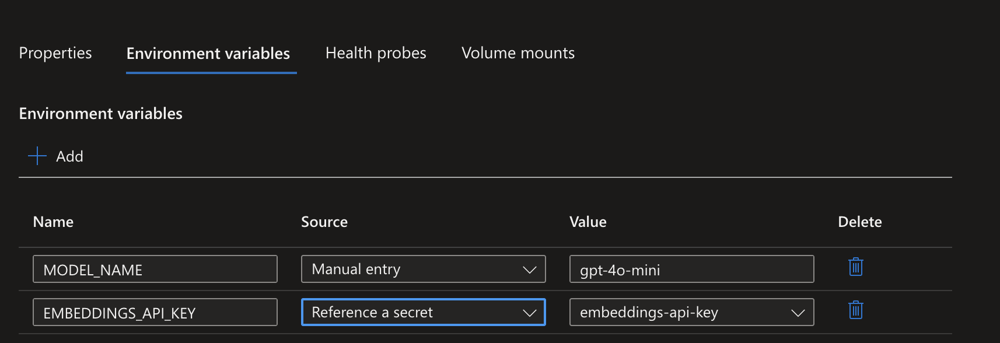
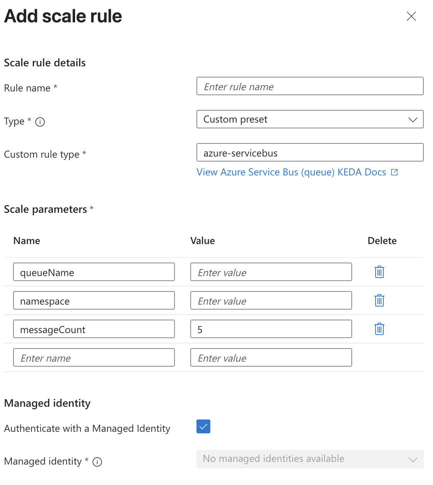

# Azure Container Apps (ACA)

## Container App Environment
1. Base infrastructure for Container Apps. It is a logical isolation boundary.
2. Can be shared by multiple container apps. Creating container apps requires at least one environment.
3. Container apps in the same environment share:
    - virtual network
    - networking rules
    - monitoring
    - log rules
4. Cannot change environment configuration after creation.
5. If lazy can use `az containerapp create up`. I.e.
```bash
az containerapp up \
    --name order-api \
    --resource-group rg-ecommerce \
    --image myregistry.azurecr.io/order-api:v1 \
    --cpu 0.5 \
    --memory 1.0Gi \
    --min-replicas 2 \
    --max-replicas 20 \
    --ingress external \
    --target-port 8080 \
    --registry-server myregistry.azurecr.io
```
6. You can create a container app using a YAML file `az containerapp create --yaml <yaml_file_name>`. 

## Revisions
1. Use Digest instead of tag for container images if you want to ensure specific version. I.e. `myregistry.azurecr.io/myapp@sha256:<digest>`. Updating is:
```
az containerapp update \
  --name <app-name> \
  --resource-group <resource-group> \
  --image <registry>/<repo>@sha256:<digest>
```
2. You can deactivate a revision `az containerapp revision deactivate`. This option is useful when you want to rollback to the previous version.
3. Feature of auto pull from registry `--enable-cd true`. Take note using `latest` image tag does not pull latest and requires restart.
4. Check revisions `az containerapp revision list`
5. Delete revision `az containerapp revision delete --name <app-name> --resource-group <resource-group> --revision <revision-name>`
6. Update default replica `az containerapp update --name <app-name> --resource-group <resource-group> --revision <revision-name>`
7. **Secret** change does not bump revision. You need to update the image to bump revision and also issue `az containerapp revision restart --name <app-name> --resource-group <resource-group>`. However, you can use `az containerapp update --name <app-name> --resource-group <resource-group> --set template.containers[0].env[0].secretRef=<new-secret-ref>` to update the secret reference, and it will bump the revision.
8. **Keyvault Secret** also does not bump revision, but there is a caveat that there is _cache_ and might not be updated. The best force is to update revision!

## Image pull behavior
1. Understanding when App Service pulls images helps you plan for deployment scenarios and troubleshoot issues.
  - Initial deployment: App Service pulls all image layers when you first deploy the container or change the image reference.
  - App restart: On restart, **App Service checks for changes and pulls only modified layers**. If the image is unchanged, the cached layers are used.
  - Scale out: When App Service adds new instances, each instance pulls the image. New instances might need to pull the full image if layers aren't cached on the underlying infrastructure.
  - Pricing tier changes: Moving to a different pricing tier might allocate new infrastructure, which pulls the image fresh and can affect startup time.


## Ingress
1. external - internet/outbound traffic enabled.
2. internal - no out bound traffic to external.
3. Code

```bash
az containerapp update \
    --name myapp \
    --resource-group myresourcegroup \
    --ingress external \
    --target-port 8080 \
    --registry-server myregistry.azurecr.io
```

## Registry authentication
1. Similar to Azure App Service, ACA uses managed identity or service principal for registry authentication.

## Revisions
1. Change in condition of:
    - container image
    - environment variables
    - secrets
    - resource allocation
    - scale rules
    - init containers
2. Revision can be deactivated.
3. You can set label to each revision.

```bash
az containerapp revision label add \
  --name <CONTAINER_APP_NAME> \
  --resource-group <RESOURCE_GROUP_NAME> \
  --revision <REVISION_NAME> \
  --label <LABEL_NAME>
```

## Environment Variables
1. Two types
    - manual
    - secretref - reference to a secret
2. Secrets are encrypted and stored separately from the environment, hence secretref:X.
3. Can be defined in YAML `az containerapp update/create --yaml`
4. Env variables can be deleted.

```json
{
  "properties": {
    "configuration": {
      "secrets": [
        {
          "name": "db-password-ref",
          "keyVaultUrl": "https://<VAULT_NAME>.vault.azure.net/secrets/<SECRET_NAME>",
          "identity": "<MANAGED_IDENTITY_RESOURCE_ID_OR_system>"
        }
      ]
    },
    "template": {
      "containers": [
        {
          "name": "my-app",
          "env": [
            {
              "name": "DATABASE_PASSWORD",
              "secretRef": "db-password-ref"
            }
          ]
        }
      ]
    }
  }
}
```



## Health Probes
1. Liveness Probe - determines if the container is running.
2. Readiness Probe - determines if the container is ready to receive traffic.
3. Default is TCP, means it will check the connection to the specified port, not via httpGET.

## Container
1. Rule: Always have Memory request 2x of CPU request.
```bash
az containerapp create \
  --name order-api \
  --resource-group rg-ecommerce \
  --environment my-environment \
  --image myregistry.azurecr.io/order-api:v1 \
  --cpu 0.5 \
  --memory 1.0Gi \
  --min-replicas 2 \
  --max-replicas 20
```
2. There is a **Dedicated** vs **Pay-as-you-go** pricing model.
3. **Dedicated** - you reserve the capacity, hence you pay for the capacity even if not in use. You can choose: 
   - **General Purpose** - 
   - **High Performance** - 


## Scale

### Scaling Rules 
1. Works via KEDA - Kubernetes Event-driven Autoscaling.
2. Rules:
  - HTTP Scaling - concurrent requests per container
  - CPU/Memory Scaling - based on cpu/memory utilization percentage
  - KEDA Scaling - External Scaling
  - Azure Service Bus Scaling - topic name + queue name + queue length
  - Azure Queue Scaling - queue name + queue length
  - Cron job Scaling - based on cron expression
  - Kafka Scaling - topic name + partition count
  - Redis Scaling - Redis length
  - RabbitMQ Scaling - queue length
  - Redis Stream Scaling - Redis length
2. Can use Managed identity.
3. Properties to be aware of:
  - --scale-rule-auth  = authorization
  - `min-replicas` and `max-replicas` default to 1.
4. Can use yaml.
5. To see replicas use `az containerapp replica list -n N -g G`.
6. To see specific replica logs
```
az containerapp logs show \
  --name <APP_NAME> \
  --resource-group <RESOURCE_GROUP> \
  --revision <REVISION_NAME> \
  --replica <REPLICA_NAME> \
  --container <CONTAINER_NAME> \
  --type console \
  --tail 50 \
  --follow true
```
7. [link](https://learn.microsoft.com/en-us/training/modules/scale-containers-azure-container-apps/4-keda-scalers-custom-workloads?pivots=text)

### Traffic Management
1. To have traffic-based scaling, enable `--revision-mode multiple`. Example `--revision-weight order-api--v1=80 order-api--v2=20`.
2. Can use latest, `--revision-weights <OLD_REVISION_NAME>=80 latest=20` or `--latest-revision true --weight 100`.
3. Labelling with revision-weight is only for traffic management. 
4. Labelling with `az containerapp revision label add --name <APP_NAME> --resource-group <RESOURCE_GROUP> --revision <REVISION_NAME> --label <LABEL_NAME>`.
5. Remember you cannot scale specific revision! You need redeployment, hence only the latest version is scaled; and you need to update the traffic control.

