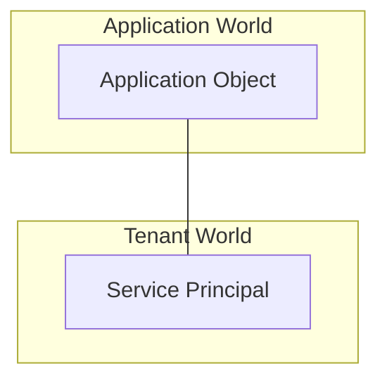

# Basic
Basics that is brought from AZ-104 Entra Management.

## Definition of Entra
1. Tenant = Digital representation of organization.
2. Subscription = (optional), but required to use cloud solution.
3. Identity = Account (User/Group/App).

## Characteristics
1. Microsoft Entra ID is primarily an identity solution, and it’s designed for internet-based applications by using HTTP (port 80) and HTTPS (port 443) communications.
2. Authentication protocol for authorization is either:
   - OAuth
   - OpenID Connect / Federated Token
   - SAML
3. Microsoft Entra **users** and **groups** are created in a **flat** structure, and there are no **OUs** or **GPOs**.
4. **Microsoft Graph** is the management layer that sits on top of Entra ID.

## Directory Service
1. Microsoft Entra ID is a **multi-tenant** directory service.
2. Each Entra ID is assigned as to only 1 **tenant** and 1 **subscription**. 
3. Each tenant can have only **one or more than one domain name**.
    - Default fixed domain name: `yourtenantname.onmicrosoft.com`
    - Identity > Settings > Custom domain names and click Add custom domain. You type in your domain (e.g., yourname.com).
4. There are only three management roles in the Microsoft Entra directory:
    - **Global Administrator**
    - **User Administrator**
    - **Service Administrator**

### Service Principals
1. Enterprise Applications are instances of applications in a tenant.
2. For the first time, application is registered in the tenant, it creates 1 object called **Application Object** (Global for tenant).
3. Then, when an admin consents to the application, it creates 1 object called **Service Principal** (Tenant Specific). ONLY for this service principal, if application is deleted, the service principal is also deleted. This is not true for other service principals in other tenants or same tenant but created through different means, which will be orphaned.

4. 1 Application Object can have multiple Service Principals.
5. Resources can only be assigned to Service Principals, not Application Objects. 

### Managed Identities (for Resources)
1. Used when an Azure resource (e.g., Virtual Machine, Web App) needs to authenticate to another resource. It eliminates the need for developers to manage credentials (secrets/certificates) in code.

    a. **System-assigned**: Tied directly to the resource lifecycle (one-to-one). This uses Service Principal concept. (1:1 Relationship between resource and service principal)
    
    b. **User-assigned**: Standalone resource, can be shared across multiple resources.

## Entra Domain Service
1. A substitute to Microsoft Active Directory Domain Services (AD DS).
2. Microsoft Entra Domain Services offers an alternative that integrates with local AD DS and provides domain services like Group Policy management and Kerberos authentication without the need for additional domain controllers. It can be used even without local AD DS, allowing organizations to create a Microsoft Entra tenant and connect it to their on-premises resources.
3. However, there are limitations, such as:
    - Support for only base Active Directory objects
    - A flat organizational unit structure
    - Restrictions on Group Policy Objects
4. Overall, Microsoft Entra Domain Services facilitates the migration of applications using LDAP, NTLM, or Kerberos protocols to the cloud without requiring domain controllers or a VPN connection to local infrastructure. The service can be enabled via the Azure portal and is billed hourly based on directory size.